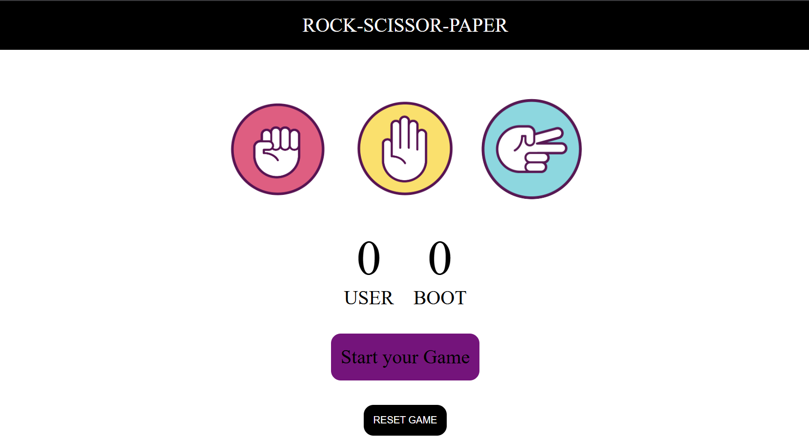

# Rock Paper Scissors Game 🎮

A simple Rock Paper Scissors game built using HTML, CSS, and JavaScript.
The game allows users to play against the computer and keeps track of scores.

## Features
- User vs Computer gameplay
- Random computer choice
- Scoreboard tracking
- Reset game option
- Fully responsive design

## Screenshots

## Tech Stack
- HTML5
- CSS3
- JavaScript

## How to Run
1. Clone the repository
2. Open index.html in your browser

## Author
Anuj
